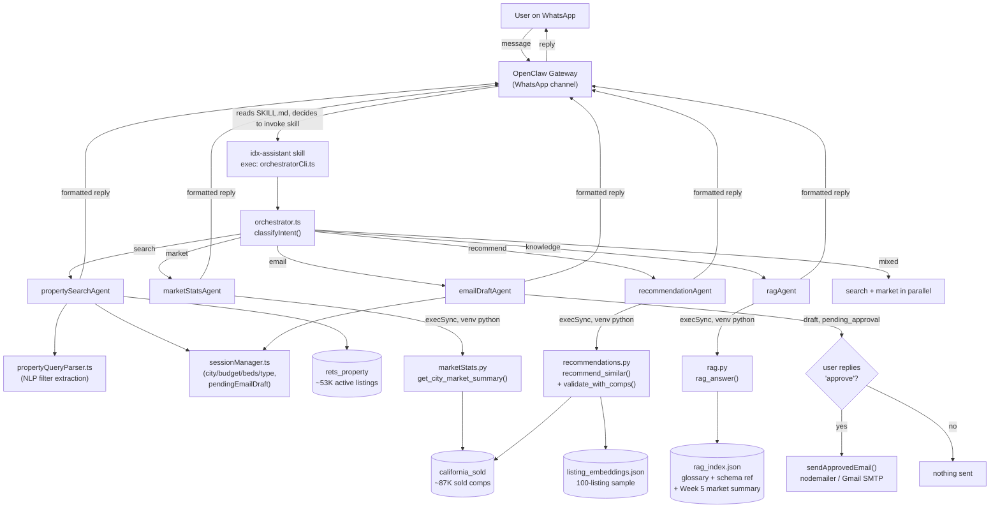

# Architecture

## Request flow

## Why it's shaped this way

- **One entry point, five specialists.** `orchestrate()` in `orchestrator.ts` is the only thing OpenClaw ever calls (via `exec`). It classifies intent with a small keyword-based rule set (`classifyIntent()`) rather than a second LLM call — cheaper and faster, at the cost of misrouting genuinely ambiguous queries (see README limitations).
- **TypeScript orchestrates, Python computes.** The agent-facing layer (intent routing, session state, WhatsApp formatting) is TypeScript; anything statistical or ML-adjacent (SQL aggregation, embeddings, RAG retrieval, recommendation scoring) is Python, called via `execSync`. The one recurring gotcha: bare `python` on PATH resolves to the system/Conda interpreter, not the project's `venv` — every `execSync` call must reference `venv/Scripts/python.exe` explicitly or the dependent packages (`mysql-connector-python`, `google-genai`, etc.) won't be found.
- **Session state is the approval gate.** The email agent never sends on the same turn it drafts. `pendingEmailDraft` lives on the same per-user session object as search filters, and only a follow-up message matching an approval pattern (`"approve"`, `"confirm"`, `"send it"`) triggers the actual `nodemailer` call — enforced in code, not just prompted for.
- **Two databases, joined loosely.** `rets_property` (active listings, IDX's own legacy field names) and `california_sold` (historical comps, RESO/Trestle-standard field names) aren't foreign-keyed together in the schema; the join is done at query time on `L_ListingID` / `ListingKey`, or on city + postal code for market-level analysis. See `docs/SCHEMA.md`.
